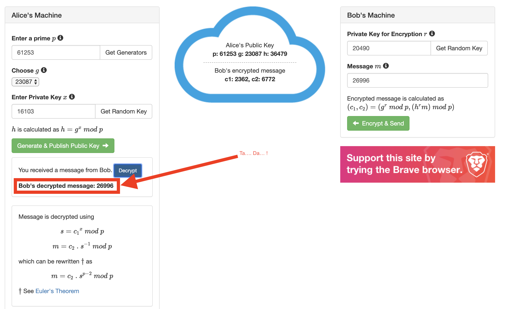

# elgamalcrypto
Simple Python Elgamal Encryption and Decryption Tool

This script was mostly used for me to learn how Elgamal works.

## Helpful Resources:
- Christof Paar's video on Elgamal - https://www.youtube.com/watch?v=tKNY1zhK3sQ
- Christof Paar's book on Cryptography - https://www.amazon.com/Understanding-Cryptography-Textbook-Students-Practitioners/dp/3642041000/
- ElGamal Encryption Playground - https://www.debjitbiswas.com/elgamal/

## Dependencies

- `pip install sympy` - This is so the prime generator works quickly.

## Example 2 Character Run with Verification

```
$ time ./elgamal.py
Warning: Anthing more than 3 characters could take a very long time to encrypt
Enter message to encrypt: it
Bob's MESSAGE         : it
MESSAGE as an int (M) : 26996
Prime number (P)      : 61253
Generator (G)         : 23087
Alice private key (X) : 16103
Bob's private key (R) : 20490
Shared secret (H)     : 36479
Encrypted Message (C1): 2362
Encrypted Message (C2): 6772
Decrypted Integer (dm): 26996
Decrypted Hex (x)     : 6974
Decrypted Message     : b'it'

real	0m1.649s
user	0m0.285s
sys	0m0.016s
```


## Example with long string

```
$ time python3 elgamal.py
Enter message to encrypt: This is a really long string for no reason what-so-ever
Bob's MESSAGE         : This is a really long string for no reason what-so-ever
MESSAGE as an int (M) : 936140450767113267965789526506206491929878298146895212622982486833192086180233170932959949678546085654866949395518767919304942183794
Prime number (P)      : 2732202483472796230552840939786318149552066588599751316514585894733284183141658331370522061142362270191703995600531377432565986089031
Generator (G)         : 655051988642726440100234687727361472241223194387260073776944847766833641196630019073062148005250400958985997330463328889516727075079
Alice private key (X) : 759674118901119348774184676944860416595917004750602667671245059401420763383429179379996432597693268146910211930534447853089180047520
Bob's private key (R) : 530420356334113032058135128983933150355974091171544040555800126132154593233892663946504466711210276928087150715709683081110998867178
Shared secret (H)     : 1195060212862396082267954454059138979164671228535241606217594017391958535941383354001276446149980324540386667396871095354193818516142
Encrypted Message (C1): 1971857674999162819409737910956982050157708632477310671437408306318414041292922331067272518172493225247118459514061942412333141234874
Encrypted Message (C2): 1036301610490361359363167858384995423342345422198137655235881896615316223008088446518190790078611876164254030601248558708515780484023
Decrypted Integer (dm): 936140450767113267965789526506206491929878298146895212622982486833192086180233170932959949678546085654866949395518767919304942183794
Decrypted Hex (x)     : 546869732069732061207265616c6c79206c6f6e6720737472696e6720666f72206e6f20726561736f6e20776861742d736f2d65766572
Decrypted Message     : b'This is a really long string for no reason what-so-ever'

real    0m12.437s
user    0m0.297s
sys     0m0.156s
```
